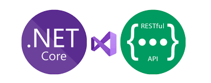

 

<H1>Project Course MVC_API </H1>

  
  
## Building an app using motion sensor with React Native - 2022
 
MVC System - Products and Categories API 
 
## Technology 
 
Here are the technologies used in this project
 
* Visual Studio Code with the following technologies:
  - Entity Framework
  - SqlServer
  - Migration
  - Code first
  - Swagger
  - MOQ
 
 
## Results
 
 
 
 
 
 
 
 
## Links
 
  - DIO: https://www.dio.me/
  
  - Repository: https://github.com/vicssb/CursoMVC-API
    - In case of sensitive bugs like security vulnerabilities, please contact
      YOUR EMAIL directly instead of using issue tracker. We value your effort
      to improve the security and privacy of this project!
 
 
## Versioning
 
1.3.0
 
 
## Author
 
* **Victor Sérgio Silva Barros**: 

  

  

  

  
  

Please follow github and join us!
Thanks for visiting and happy coding!
