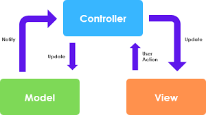
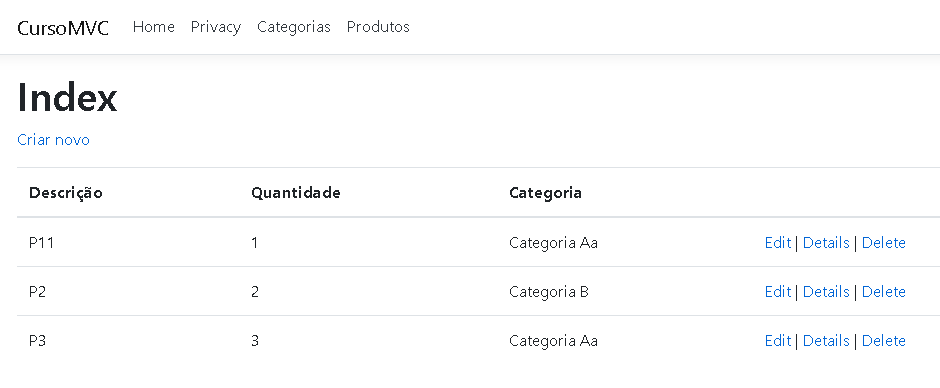

# Documentação do Projeto CursoAPI

## Visão Geral

O projeto **CursoAPI** é uma aplicação desenvolvida em **.NET Core 3.0** com arquitetura **MVC** para controle de produtos e categorias. O sistema é composto por três módulos principais:

- **CursoAPI**: API responsável por fornecer os dados.
- **CursoMVC**: Interface web para interação com os dados.
- **CursoTest**: Módulo de testes unitários e de integração.




## Dependências

As dependências utilizadas no projeto estão listadas na tabela abaixo:

| Dependência                                                                                                                               | Versão    | Descrição                                          |
| ----------------------------------------------------------------------------------------------------------------------------------------- | --------- | -------------------------------------------------- |
| [Microsoft.EntityFrameworkCore.SqlServer](https://www.nuget.org/packages/Microsoft.EntityFrameworkCore.SqlServer/3.1.0)                   | 3.1.0     | ORM para interação com o SQL Server                |
| [Microsoft.EntityFrameworkCore.Tools](https://www.nuget.org/packages/Microsoft.EntityFrameworkCore.Tools/3.1.0)                           | 3.1.0     | Ferramentas para EF Core                           |
| [Swashbuckle.AspNetCore](https://www.nuget.org/packages/Swashbuckle.AspNetCore/5.0.0-rc5)                                                 | 5.0.0-rc5 | Documentação da API via Swagger                    |
| [Microsoft.EntityFrameworkCore.Design](https://www.nuget.org/packages/Microsoft.EntityFrameworkCore.Design/3.1.0)                         | 3.1.0     | Suporte a migrações do EF Core                     |
| [Microsoft.Extensions.Logging.Debug](https://www.nuget.org/packages/Microsoft.Extensions.Logging.Debug/3.1.0)                             | 3.1.0     | Logging para depuração                             |
| [Microsoft.VisualStudio.Web.CodeGeneration.Design](https://www.nuget.org/packages/Microsoft.VisualStudio.Web.CodeGeneration.Design/3.1.0) | 3.1.0     | Ferramentas para geração de código em projetos MVC |
| [Microsoft.NET.Test.Sdk](https://www.nuget.org/packages/Microsoft.NET.Test.Sdk/16.2.0)                                                    | 16.2.0    | SDK para testes unitários                          |
| [Moq](https://www.nuget.org/packages/Moq/4.13.1)                                                                                          | 4.13.1    | Biblioteca para simulação de objetos em testes     |
| [xUnit](https://www.nuget.org/packages/xunit/2.4.0)                                                                                       | 2.4.0     | Framework de testes                                |
| [xUnit.runner.visualstudio](https://www.nuget.org/packages/xunit.runner.visualstudio/2.4.0)                                               | 2.4.0     | Runner do xUnit para o Visual Studio               |
| [coverlet.collector](https://www.nuget.org/packages/coverlet.collector/1.0.1)                                                             | 1.0.1     | Ferramenta para coleta de cobertura de testes      |

## Estrutura do Projeto

A estrutura do projeto segue a organização abaixo:

### CursoAPI


```
CursoAPI/
|-- Controllers/
|   |-- ProdutoController.cs
|   |-- CategoriaController.cs
|
|-- Models/
|   |-- Produto.cs
|   |-- Categoria.cs
|
|-- Data/
|   |-- CursoContext.cs
|
|-- Startup.cs
|-- Program.cs
```

### CursoMVC


```
CursoMVC/
|-- Controllers/
|   |-- HomeController.cs
|   |-- ProdutoController.cs
|
|-- Views/
|   |-- Home/
|   |   |-- Index.cshtml
|   |-- Produto/
|   |   |-- Index.cshtml
|
|-- Models/
|   |-- ProdutoViewModel.cs
|
|-- Startup.cs
|-- Program.cs
```

### CursoTest


```
CursoTest/
|-- UnitTests/
|   |-- ProdutoServiceTests.cs
|   |-- CategoriaServiceTests.cs
|
|-- IntegrationTests/
|   |-- ProdutoControllerTests.cs
```

## Técnicas Utilizadas

- **MVC (Model-View-Controller)**: Separando responsabilidades entre controle, visualização e modelo.
- **Entity Framework Core**: Utilizado para persistência de dados no banco SQL Server.
- **Swagger (Swashbuckle)**: Documentação interativa da API.
- **xUnit e Moq**: Para testes unitários e de integração.
- **Coverlet**: Para medição de cobertura de testes.

## Results
 
 
 
 
 

  
## Links
 
  - DIO: https://www.dio.me/
  
  - Repository: https://github.com/vicssb/CursoMVC-API
    - In case of sensitive bugs like security vulnerabilities, please contact
      YOUR EMAIL directly instead of using issue tracker. We value your effort
      to improve the security and privacy of this project!
 
 
## Versioning
 
1.3.0
 
 
## Author
 
* **Victor Sérgio Silva Barros**: 


<p align="left">
  <a href="mailto:vicssb@gmail.com" alt="Gmail" target = "_blank">
  </a>

  <a href="https://www.linkedin.com/in/victor-sergio-silva-barros/" alt="Linkedin" target = "_blank">
  </a>

  <a href="https://wa.me/+5512981328278" alt="WhatsApp" target = "_blank">
  </a>

  </p>  

<p>Please follow github and join us!
Thanks for visiting and happy coding!</p> 

